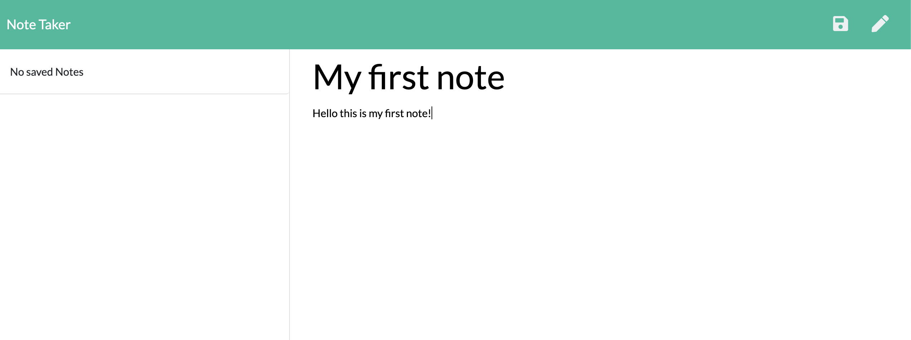
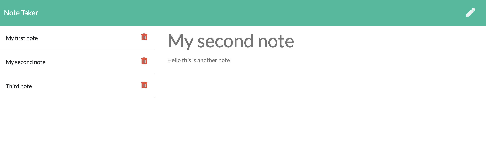

# note-taker

Link to deployed App: 

## Description:
> This is a simple note taking application.  The User can add any number of notes organized by a title and save it.  They can view previously written notes and then they can delete them.

### Usage: 
To use this application, just click get started. Enter the title of the note you wish to start writing and then write the note itself.  When you are finished just click the save button in the upper right corner.  You will see your saved notes kpopulate on the left column.  To view a previous note click one of the notes in the left column, and to delete it click the trash icon next to that note.

### Entering a note:

### Viewing an old note:

